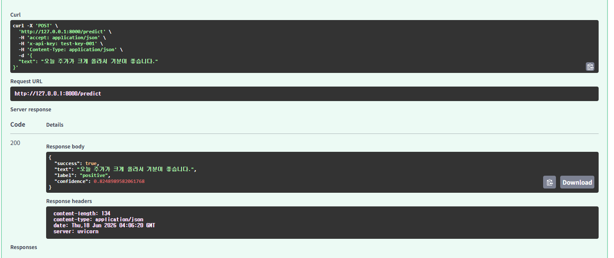
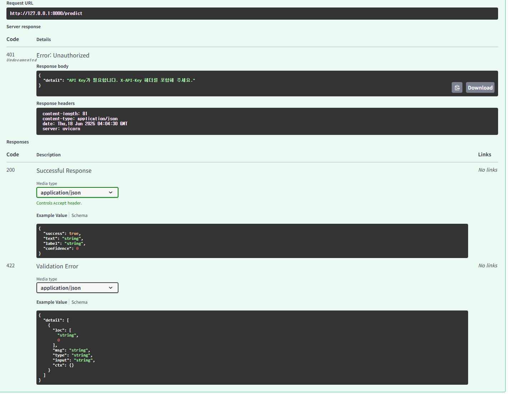
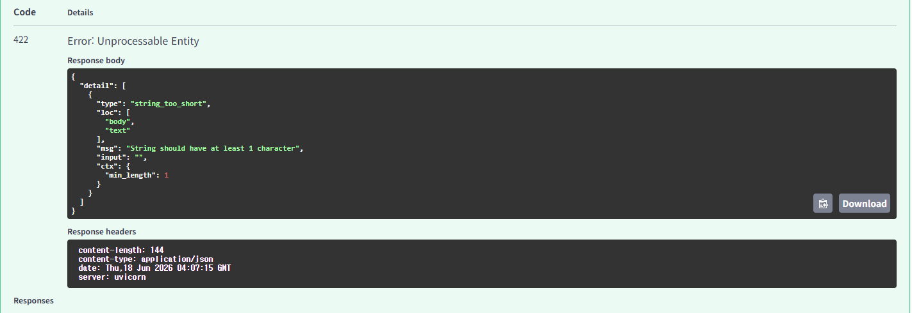
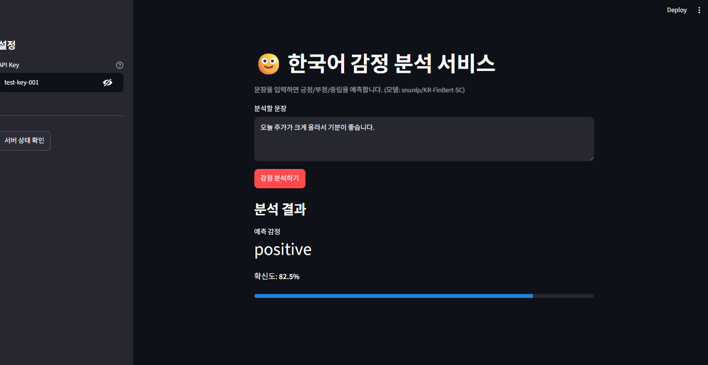

# Day 8 자율 프로젝트 — 한국어 감정 분석 서빙 서비스

문장을 입력하면 **긍정 / 부정 / 중립** 감정을 예측해 주는 모델 서빙 서비스입니다.
Day 1~7에서 배운 기술(FastAPI · Pydantic · 비동기 추론 · API Key 인증 · Streamlit)을 조합해
직접 설계하고 구현했습니다.

- **도메인 / 태스크**: 텍스트 감정 분석 (`text-classification`)
- **사용 모델**: [`snunlp/KR-FinBert-SC`](https://huggingface.co/snunlp/KR-FinBert-SC)
  (한국어 문장의 감정을 positive / negative / neutral 로 분류하는 사전학습 모델)

---

## 1. 프로젝트 구조

```
model8-sentiment-service/
├── app/
│   ├── auth.py            # API Key 인증 (Day 6 재사용)
│   ├── schemas.py         # 입력/출력 검증 스키마 (Pydantic)
│   ├── model_service.py   # 모델 로드 + 추론 함수
│   └── main.py            # FastAPI 서버 (엔드포인트 조립)
├── frontend/
│   └── app.py             # Streamlit 사용자 화면
├── model8.ipynb           # 실행/테스트용 노트북
├── requirements.txt
└── README.md
```

### 처리 흐름

```
[Streamlit UI] --(문장 + X-API-Key)--> [FastAPI /predict]
                                            │ 1. Pydantic 입력 검증 (잘못되면 422)
                                            │ 2. API Key 인증 (없거나 틀리면 401)
                                            │ 3. run_in_executor로 비동기 추론
                                            ▼
                                       [감정분석 모델]
                                            │
[Streamlit UI] <--(label, confidence)----  결과 반환
```

---

## 2. 실행 방법

### 2-1. 라이브러리 설치

```bash
pip install -r requirements.txt
```

### 2-2. 서버 실행 (둘 중 하나)

**방법 A — 노트북에서 실행**: `model8.ipynb`를 열고 위에서부터 셀을 실행하면
`serve_in_thread("app.main:app", port=8000)` 셀에서 서버가 뜹니다.

**방법 B — 터미널에서 실행**:

```bash
uvicorn app.main:app --reload
```

서버가 뜨면 브라우저에서 `http://localhost:8000/docs` 로 Swagger UI를 열 수 있습니다.

### 2-3. Streamlit 화면 실행 (서버가 켜진 상태에서)

```bash
streamlit run frontend/app.py
```

---

## 3. 실행 내역 (캡쳐 + 설명)

> 아래 4개 항목이 평가 기준이며, 각 항목을 실제로 실행한 캡쳐를 첨부했습니다.

### ✅ 3-1. 서버 정상 실행 / Swagger UI 추론 동작

`http://localhost:8000/docs` 에서 `/predict`에 문장을 넣고 실행한 결과입니다.
정상 입력(`"오늘 주가가 크게 올라서 기분이 좋습니다."`)에 대해 `200 OK`와 함께
`label`, `confidence`가 반환됩니다.



### ✅ 3-2. API Key 없이 요청하면 401

`X-API-Key` 헤더 없이 `/predict`를 호출하면 `401 Unauthorized`와
`"API Key가 필요합니다. ..."` 메시지가 반환됩니다.



### ✅ 3-3. 잘못된 입력에 대한 에러 처리

빈 문자열(`""`)이나 1000자를 초과한 입력을 보내면 Pydantic 검증에 걸려
`422 Unprocessable Entity`와 함께 "어느 필드가 왜 잘못됐는지"가 반환됩니다.



### ✅ 3-4. Streamlit UI에서 입력 → 결과 확인

`streamlit run frontend/app.py`로 띄운 화면에서 문장을 입력하고
[감정 분석하기]를 누르면 예측 감정과 확신도가 표시됩니다.



---

## 4. 섹션 체크포인트 답변

### Q1. 본인의 프로젝트에서 Pydantic 검증은 어떤 잘못된 입력을 막아줍니까?

`PredictRequest`에서 `text` 필드에 다음 규칙을 걸었습니다.

- **필수 필드(`...`)** — `text`가 아예 없으면 422로 막습니다.
- **`min_length=1`** — 빈 문자열(`""`)을 막습니다. (모델에 의미 없는 입력 방지)
- **`max_length=1000`** — 지나치게 긴 입력을 막습니다. (메모리/시간 폭주 방지)
- **타입 검사** — `text`에 숫자나 리스트 등 문자열이 아닌 값이 오면 막습니다.

이런 입력은 모델에 도달하기 **전에** 걸러져서, 서버가 엉뚱한 입력으로
오류를 내거나 멈추는 것을 예방합니다.

### Q2. `Depends(verify_api_key)`를 제거하면 어떤 위험이 있습니까?

인증이 사라져 **누구나 키 없이** `/predict`를 호출할 수 있게 됩니다.

- 외부에서 무제한으로 호출해 서버 자원을 소모(요청 폭주 → 비용/장애).
- 누가 얼마나 사용하는지 식별/제한할 수 없어 남용을 통제하지 못함.
- 유료 API라면 과금 주체를 구분할 수 없음.

`Depends(verify_api_key)` 한 줄이 "키를 가진 사용자만" 통과시키는 문지기 역할을 합니다.

### Q3. `run_in_executor`를 사용한 이유는 무엇입니까?

모델 추론은 CPU를 오래 붙잡는 **동기(blocking) 작업**입니다.
FastAPI는 기본적으로 하나의 이벤트 루프로 여러 요청을 번갈아 처리하는데,
추론을 그냥 호출하면 그 동안 **이벤트 루프 전체가 멈춰** 다른 요청을 받지 못합니다.

그래서 `ThreadPoolExecutor`의 별도 스레드에서 추론을 돌리고
(`await loop.run_in_executor(executor, predict, model, text)`),
서버는 결과를 기다리는 동안에도 다른 요청을 계속 처리할 수 있게 했습니다.

### Q4. Day 1~8 중 가장 많이 참고한 Day는 어디였습니까? 왜?

- **Day 6** — API Key 인증(`auth.py`)과 `run_in_executor` 비동기 추론,
  `Depends()` 적용 패턴을 거의 그대로 가져왔습니다.
- **Day 5** — `/health` + `/predict` 엔드포인트 구성과 Pydantic 요청/응답
  스키마를 나누는 전체 FastAPI 구조의 뼈대로 삼았습니다.

감정분석은 모델만 다를 뿐 "API로 감싸 인증을 붙이고 비동기로 추론한다"는
구조가 같아서, 이 두 Day를 기준으로 모델 부분만 교체하는 식으로 만들었습니다.

### Q5. 이 서비스를 실제로 배포하려면 추가로 무엇이 필요합니까?

- **Docker 패키징** — 어디서나 동일하게 실행되도록 환경을 박제.
- **클라우드 배포 + HTTPS** — 외부에서 접근 가능하고 암호화된 통신.
- **키 관리** — `VALID_API_KEYS`를 코드가 아니라 환경변수/비밀저장소로 분리.
- **모니터링 / 로깅** — 요청량, 지연시간, 에러율을 관찰.
- **확장(스케일링)** — 요청이 몰릴 때 인스턴스를 늘리는 구성.

이 부분이 다음 단계인 **MLOps**에서 다루는 영역입니다.

---

## 5. 프로젝트 회고

### 무엇을 했나

Day 1~7에서는 교안을 따라 조립했다면, 이번에는 직접 모델(`snunlp/KR-FinBert-SC`)을 고르고
설계 → 구현 → 테스트까지 스스로 진행했습니다. 감정분석이라는 태스크에 맞게
입력 스키마(문장 하나)와 출력 스키마(라벨 + 확신도)를 정의하고,
인증·비동기·에러처리·Streamlit UI를 한 서비스로 묶었습니다.

### 교안 없이 작성할 수 있었는가 / 어디를 다시 봤는가

전체 구조(FastAPI + 인증 + 비동기)는 머릿속에 흐름이 잡혀 있어 직접 작성할 수 있었습니다.
다만 `run_in_executor`의 정확한 호출 형태와 `lifespan`으로 모델을 로드하는 방식은
Day 5·6 코드를 다시 확인했습니다. "패턴은 같고 모델만 바뀐다"는 점을 체감했습니다.

### 다음에 다시 만든다면

- 라벨을 사용자에게 친숙한 한국어(긍정/부정/중립)로 매핑해 보여주기.
- 여러 문장을 한 번에 분석하는 배치 입력 지원.
- 키를 환경변수로 분리하고, 요청 로그를 남겨 사용량을 관찰하기.

### 가장 어려웠던 부분

추론이 "서버를 멈추게 하는 작업"이라는 점을 이해하고, 왜 별도 스레드에서
돌려야 하는지를 납득하는 과정이 가장 핵심이자 어려운 지점이었습니다.
`run_in_executor`가 단순한 문법이 아니라 "서버가 멈추지 않게 하는 장치"라는
의미로 이해되면서 비동기 처리의 이유가 분명해졌습니다.
